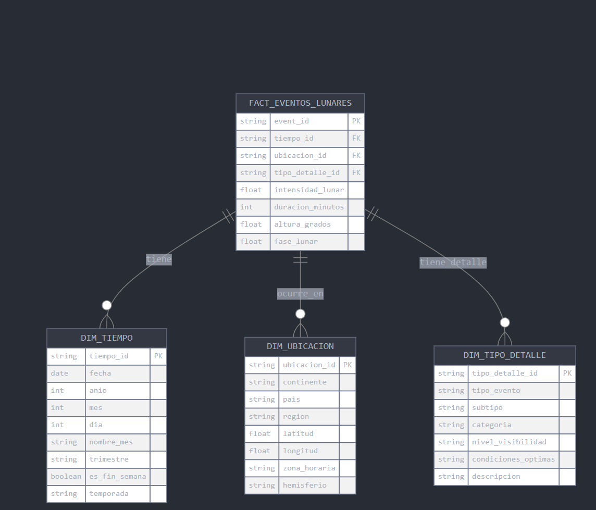

# Diseño del Esquema Dimensional

## 1. Tabla de Hechos: FACT_EVENTOS_LUNARES

### Descripción

Almacena todos los eventos lunares registrados con sus métricas y referencias a dimensiones.

### Columnas

* **event_id** : Identificador único del evento (PK)
* **tiempo_id** : Referencia a la dimensión tiempo (FK)
* **ubicacion_id** : Referencia a la dimensión ubicación (FK)
* **tipo_detalle_id** : Referencia a la dimensión de tipo y detalles (FK)
* **intensidad_lunar** : Medida de la intensidad del evento lunar
* **duracion_minutos** : Duración del evento en minutos
* **altura_grados** : Altura en grados sobre el horizonte
* **fase_lunar** : Fase lunar en el momento del evento

## 2. Dimensiones

### DIM_TIEMPO

Dimensión que captura todos los aspectos temporales del evento.

#### Columnas

* **tiempo_id** : Identificador único (PK)
* **fecha** : Fecha completa del evento
* **anio** : Año del evento
* **mes** : Mes del evento
* **dia** : Día del evento
* **nombre_mes** : Nombre del mes
* **trimestre** : Trimestre del año
* **es_fin_semana** : Indicador de fin de semana
* **temporada** : Temporada del año

### DIM_UBICACION

Dimensión que captura la información geográfica del evento.

#### Columnas

* **ubicacion_id** : Identificador único (PK)
* **continente** : Continente donde ocurrió el evento
* **pais** : País del evento
* **region** : Región específica
* **latitud** : Coordenada latitud
* **longitud** : Coordenada longitud
* **zona_horaria** : Zona horaria de la ubicación
* **hemisferio** : Hemisferio (Norte/Sur)

### DIM_TIPO_DETALLE

Dimensión que almacena los detalles y características del evento.

#### Columnas

* **tipo_detalle_id** : Identificador único (PK)
* **tipo_evento** : Tipo principal del evento
* **subtipo** : Subtipo específico
* **categoria** : Categorización adicional
* **nivel_visibilidad** : Nivel de visibilidad del evento
* **condiciones_optimas** : Condiciones óptimas para observación
* **descripcion** : Descripción detallada

## 3. Justificación del Diseño

### Granularidad

* La tabla de hechos registra cada evento lunar individual
* Permite análisis detallado por evento
* Soporta agregaciones a diferentes niveles

### Ventajas del Diseño

1. **Flexibilidad en Análisis**
   * Permite análisis por tiempo, ubicación y tipo de evento
   * Soporta drill-down y roll-up en múltiples dimensiones
2. **Optimización de Consultas**
   * Esquema en estrella para mejor rendimiento
   * Dimensiones desnormalizadas para reducir JOINs
3. **Escalabilidad**
   * Diseño preparado para crecimiento futuro
   * Soporte para nuevos tipos de eventos
4. **Facilidad de Uso**
   * Estructura intuitiva para analistas
   * Dimensiones con atributos descriptivos claros

## 4. Uso para Análisis

### Ejemplos de Análisis Soportados

1. Patrones temporales de eventos lunares
2. Distribución geográfica de eventos
3. Correlación entre tipos de eventos y ubicaciones
4. Análisis de estacionalidad
5. Tendencias por región y periodo

